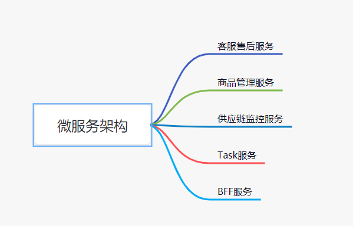

#### 项目现状
##### 简述
目前项目是采用gin开发的单体架构，前端部分采用
vue-element-admin的开源系统
##### 项目结构
```
|-- cmd
|    -- apiserver           #正式环境目录
|       |-- conf               #正式环境配置
|       |-- log                 #正式环境日志
|       |-- public
|-- conf
|-- docs                        #swagger api文件目录
|-- internal
|    -- app
|       |-- config              #配置结构体
|       |-- context            #上下文
|       |-- errors              #错误定义
|       |-- ginplus            #对gin常用功能的封装
|       |-- middleware     #gin中间件
|       |-- model              #模型，针对数据表
|       |-- router              #API路由，类似MVC里的controller
|       |-- schema            #API的输入和输出的定义，用于swagger
|       |-- service             #服务,业务功能代码
|-- log                           #本地存放日志文件
 -- pkg                          #工具包
    |-- extend                 #额外的扩展功能
    |-- gormplus            #gorm的常用功能封装
    |-- gredis                  #redis功能的封装
    |-- logger                 #日志功能
    |-- token                  #生成和校验token
    |-- util                      #常用项
    |-- version               #项目版本
```
##### 存在的问题

1. API涉及到的输入参数和输出结果都需要额外定义结构体，用来生成swagger
2. 业务代码比较混乱，有一部分在model。目录结构层次没有把控好。
3. 错误定义规范也没有定义好

#### 微服务
##### 简述
由于项目涉及到三个大模块，客服售后模板，商品管理，供应链监控。 可以考虑拆成如下功能点


#### 微服务组成描述
1. 客服售后服务、商品管理服务、供应链监控服务提供业务能力，使用gRPC对外提供服务，发送消息到kafka
2. Task服务
消费消息，完成定时任务
3. BFF服务
对接前端和后端微服务,提供swagger API文档

#### 微服务项目结构
```
-- app
    |-- api
    |   --- product       #gRPC
    |-- cmd
    |   --- product       #main包 二进制的生成
    |-- configs            #项目配置yaml
    -- internal
        |-- biz             #biz层
        |-- config         #配置
        |-- data           #数据交互层  采用gorm
        |-- domain       #DO层
        |-- service        #服务层，主要的业务代码
```

#### 总结
##### 优势
1. 简化单一的业务，使用kafka解耦业务
2. 逻辑清晰
3. 可扩展
##### 劣势

1. 复杂度高
2. 运维复杂


#### 毕业总结
在这不只13周的学习中，讲了DNS、分布式缓存事务，微服务，网络编程等等。 看到了一套完整的工程化体系，从客户端到服务端的方方面面， 受益不浅。
 学习的建议：毛老师的视频一定要多刷几遍，每次刷都有不同的体会。 还有PPT后面的References，要花点时间慢慢看完
